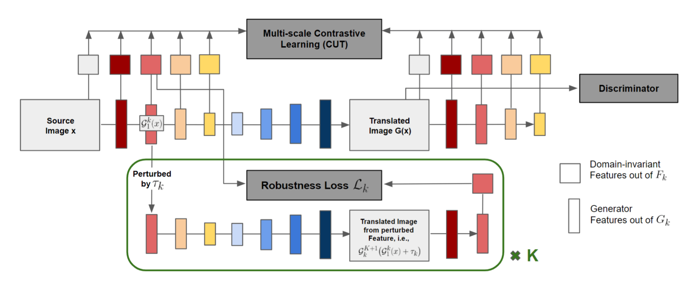
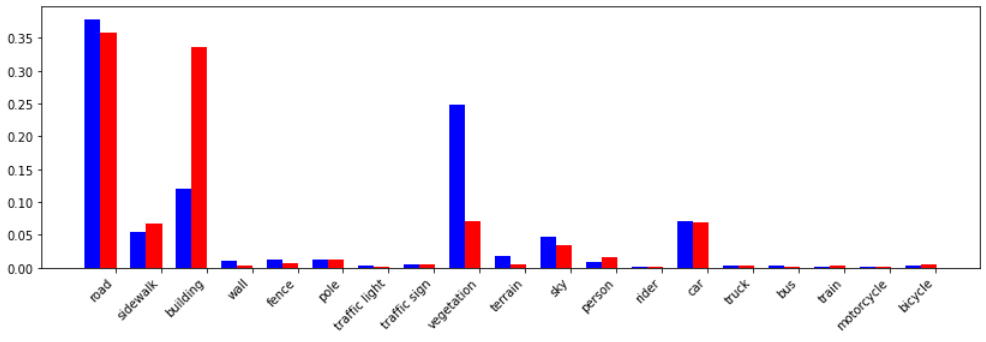

# Code for Semantically Robust Unpaired Image Translation for Data with Unmatched Semantics Statistics (SRUNIT), ICCV 2021

This is a PyTorch (re-)implementation of the method presented in the following paper:

[Semantically Robust Unpaired Image Translation for Data with Unmatched Semantics Statistics](https://arxiv.org/pdf/2012.04932.pdf)<br>
Zhiwei Jia, Bodi Yuan, Kangkang Wang, Hong Wu, David Clifford, Zhiqiang Yuan, Hao Su<br>
UC San Diego and Google X<br>
ICCV 2021

The code is largely adapted from the PyTorch implementation of [CUT](http://taesung.me/ContrastiveUnpairedTranslation/) from the Github repo [link](https://github.com/taesungp/contrastive-unpaired-translation).
Specifically, SRUNIT deals with the common and detrimental sementic flipping issue in unpaired image translatios by equipping CUT with a novel multi-scale semantic robustness regularization strategy.
The key idea is to encourage a consistent translation such that contents of the same semantics are not transformed into contents of several different semantics.
The data flow is illustrated below 



### Some Technical Details
We provide two versions of the implementation for performing backward pass for the semantic robustness (SR) loss `self.compute_reg_loss()`.
Namely, `v1` where the SR loss is used to update G (the generator) but not F (the domain-invariant feature extractor in CUT) and `v2` where it is used to update both.
We find that `v2` outperforms `v1` consistently and use the latter as the default value for `--reg_type`.

```Python
# Update G and F.
self.set_requires_grad(self.netD, False)
self.set_requires_grad(self.netF, True)
self.optimizer_G.zero_grad()
self.loss_G = self.compute_G_loss()
self.optimizer_F.zero_grad()
if self.opt.reg_type == 'v1':
    self.loss_G.backward(retain_graph=True)
    self.set_requires_grad(self.netF, False)
    self.loss_reg = self.compute_reg_loss()
    loss = self.reg * self.loss_reg
elif self.opt.reg_type == 'v2':
    self.loss_reg = self.compute_reg_loss()
    loss = self.loss_G + self.reg * self.loss_reg
loss.backward()
self.optimizer_G.step()
self.optimizer_F.step()
```

To improve the computational efficiency of SRUNIT so that it achieves a training speed comparable to CUT, at each gradient update, we sample one scale at a time for injecting the noises to the features, as shown below.

```Python
# By default reg_layers = '0,1,2,3,4' (the multi-scale loss)
choices = [int(l) for l in self.opt.reg_layers.split(',')] 
self.choice = np.random.choice(choices, 1)[0]
self.feats_perturbed, self.noise_magnitude = self.netG(
    layers=[self.nce_layers[self.choice]],
    feats=[self.feats_real_A[self.choice]],
    noises=[self.opt.reg_noise]
)
```

To further reduce the computation burden, at each time we only sample feature vectors at `256` position using the generated `sample_ids` from `PatchSampleF`, similar to the constrastive loss in CUT. The pseudo-code is shown below.

```Python
def compute_reg_loss(self):
    # ... some steps omitted here ...
    
    # f_q, f_k are features from the original src images and the that with feature perturbation.
    noise_mag = self.noise_magnitude[0]  # Only one scale at a time.
    noise_mag = (noise_mag.flatten(1, 3)[:, sample_ids]).flatten(0, 1)
    loss = euc_dis(f_q, f_k) / noise_mag  # euc_dis is a distance function
    return loss.mean()
```

## Training

While most of the hyper-parameters are inherited from `CycleGAN` and `CUT`, we have 3 hyper-parameters that can be domain-dependent and might need some level of tuning, namely

    --reg_noise: the max magnitude of injected noises in computing SR loss, usually 0.001
    --reg: the coefficient for SR loss, 0.001 is usually a good default value
    --inact_epochs: the number of initial epochs where SR loss is inactivated, usually 1/4 of total training epochs

With the task `Label-to-Image` from Cityscapes as an example, the training script is

```Python
python train.py --dataroot=$DATA_FOLDER --preprocess=crop --n_epochs=200 --n_epochs_decay=200 \
    --reg_layers=0,1,2,3,4 --reg_noise=0.001 --reg=0.001 --init_epochs=100 --name=$MODEL_NAME 
```

The path `$DATA_FOLDER` should be structured such that `$DATA_FOLDER/trainA` and `$DATA_FOLDER/trainB` contain images from the source and the target domain, respectively.
The model is trained with `200 + 200 = 400` epochs and we set `init_epochs` as 1/4 of it.

`reg_layers` ?

Notice that this implementation (as adapted from `CUT`) currently does not support multi-gpu training and the default batch size is 1.

## Evaluation

The evaluation script is

```Python
python test.py --dataroot=$DATA_FOLDER --name=$MODEL_NAME --epoch=latest --preprocess=none \
    --phase=val --output_path=$OUTPUT_PATH
```

Where similarly there should be `valA` & `valB` or  `testA` & `testB` (`*B` can be empty) under the directory `$DATA_FOLDER` and the phase `--phase` controls where to load the data for inference.

## Results 

We here show the reproduced results on the `Label-to-Image` task from the Cityscapes dataset. As mentioned in the paper, we sub-sample the images to create a statistical discrepancy between the source and the target domain, which is a natural setup in most real-world unpaired image translation tasks.
Specifically, we use K-means to generate two clusters of images based on the their different semantic distribution (illustrated below).
We list the original filenames for the source and target images used in our setup in `examples/src_domain_paths.txt` and `examples/tar_domain_paths.txt`, repectively.



The numerical results below demonstrate the clear advantage of SRUNIT over the previous state-of-the-art method CUT.

|       | PixelAcc (%) | ClassAcc (%) | Mean IoU |
| ----------- | ----------- | ----------------- | --------- |
| CUT      | 74.39 | 30.61 | 23.86 |
| SRUNIT   |   t    | t | t |
