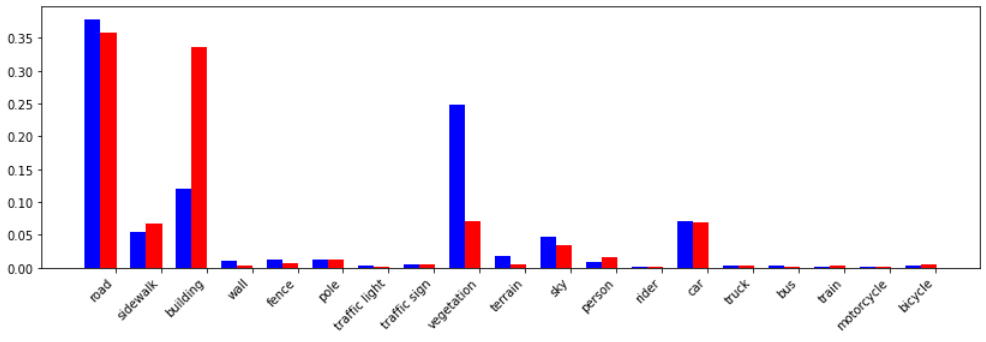

# PyTorch Implementation for Semantically Robust Unpaired Image Translation for Data with Unmatched Semantics Statistics (SRUNIT)

## Intro

Adapted from CUT.

Multi-scale semantic robustness regularization

`v2` vs. `v1`.

sample one scale per gradient step and 256 positions per step

## Training

## Evaluation

## Example 

